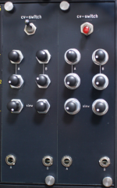
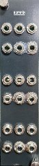

# What is this?

Collection of eurorack modules I designed.

You can find documentation, as well as schematics and gerber files.

All modules are licenced under **CC BY-SA 4.0**.

# CV-Switch

Module that outputs **two switched control voltages** with **exponential RC slew limiters**.

[More info & demo video](cv-switch/)

# Summix

3-channel summing mixer with 4 inputs and 2 buffered outputs for each channel.

[More info](summix/)

