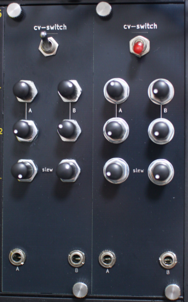
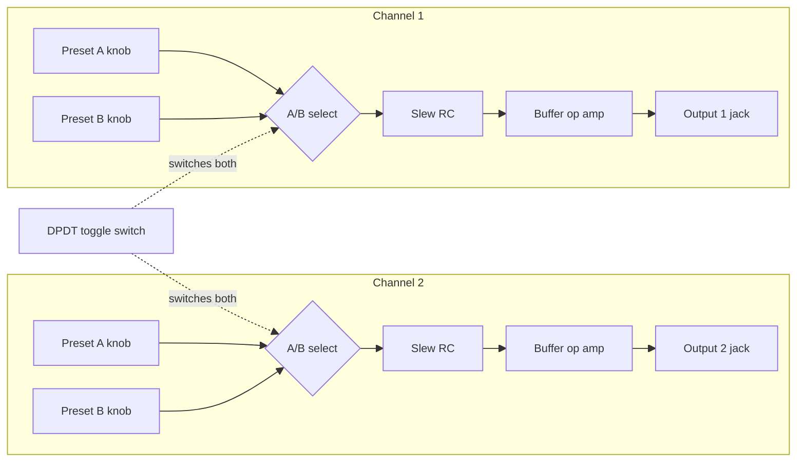
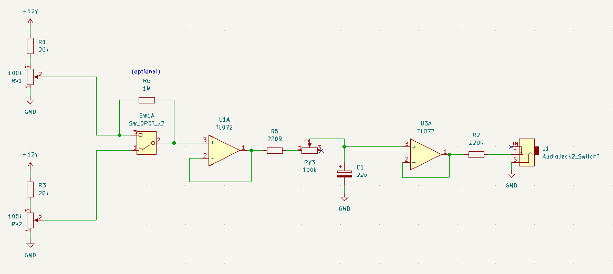

# CV-Switch

A simple, low-cost Eurorack DIY module that outputs **two switched control voltages** with **exponential RC slew limiters**, focused on simple schematics.

Each output can be set to one of **two knob-defined voltages** (“A” and “B”). A single **DPDT toggle switch** flips _both outputs_ between A and B at the same time. Each output also has a **slew** control with an **exponential RC** curve - if you modulate pitch CV, you can "hear" the capacitor charge. I love it :-)

## Demo-Video

Left module controls pitch and twist of 4ms Ensemble. Right module controls VCF highpass cutoff frequency.

https://github.com/user-attachments/assets/a2533407-694b-4e1d-8e46-d9b85c6f17b2

## Repository content

- doc/BOM.csv: Bill of materials

- cv-switch/
  - cv-switch.kicad_sch / cv-switch.kicad_pcb: main circuit board
  - Output/: generated gerbers/drills for the main board

- cv-switch-panel/
  - cv-switch-panel.kicad_pcb: front panel PCB (text/art + mounting)
  - Output/: generated gerbers/drills for the panel

# How it works

## Block diagram

## Schematic

The schematic of a single channel (there are 2 of them):

]

## License

Licensed under **CC BY-SA 4.0**.
