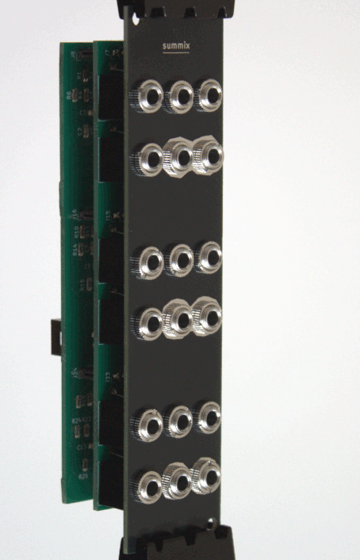
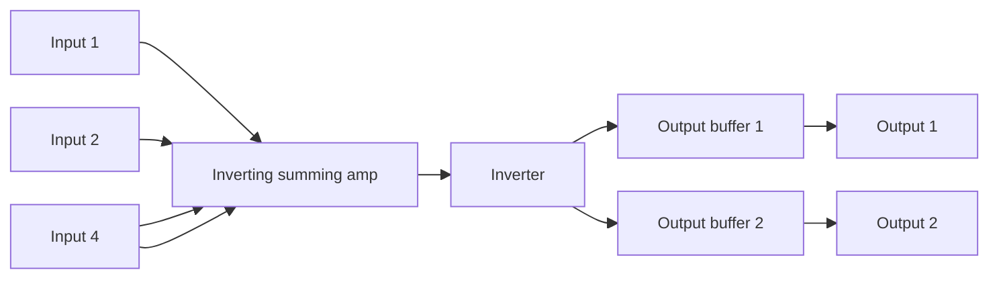
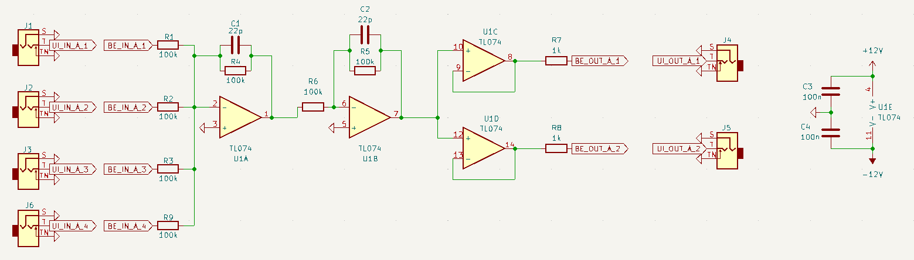

# Summix

A simple, low-cost Eurorack 3-channel summing mixer with 4 inputs and 2 separately buffered outputs for each channel.

The mixer is fully **DC-coupled**, **Unit-Gain**, **Non-Inverting**. Nothing fancy. Just adding signals.

## Repository content

- doc/BOM.csv: Bill of materials

- summix-pcb/
    - summix-pcb.kicad_sch / summix-pcb.kicad_pcb: main circuit board
    - gerbers/: generated gerbers/drills for the main board

- summix-panel/
    - summix-panel.kicad_pcb: front panel PCB (text/art + mounting)
    - gerbers/: generated gerbers/drills for the panel

# How it works

## Block diagram

## Schematic

The schematic of a single channel (there are 3 of them):

## License

Licensed under **CC BY-SA 4.0**.
